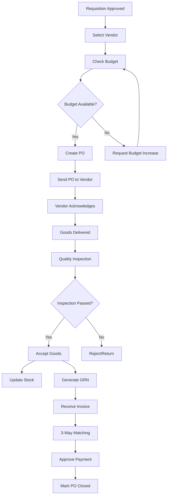

# Phase 5: Procurement Operations

## Overview
Phase 5 focuses on the core procurement operations after manager approval, including vendor management, purchase order creation, and budget tracking.

## Components to Build

### 1. Vendor Management System

#### Features
- Vendor registration and onboarding
- Vendor profile management (contact info, payment terms, categories)
- Vendor performance tracking
- Vendor blacklisting/whitelisting
- Document management (licenses, certificates)

#### Database Tables Needed
```sql
- vendors
  - id
  - name
  - contact_person
  - email
  - phone
  - address
  - payment_terms
  - category (array)
  - performance_rating
  - status (active, inactive, blacklisted)
  - documents (jsonb)
  - created_at
  - updated_at

- vendor_performance
  - id
  - vendor_id
  - rating
  - on_time_delivery_rate
  - quality_score
  - response_time
  - total_orders
  - period_start
  - period_end
```

### 2. Purchase Order (PO) Generation

#### Features
- Convert approved requisitions to POs
- Multi-vendor PO splitting
- PO approval workflow
- PO amendment support
- PO cancellation
- Auto-numbering
- PDF generation for POs

#### Database Tables Needed
```sql
- purchase_orders
  - id
  - po_number
  - requisition_list_id
  - vendor_id
  - total_amount
  - tax_amount
  - grand_total
  - payment_terms
  - delivery_date
  - delivery_address
  - status (draft, sent, acknowledged, partially_received, received, closed)
  - created_by
  - approved_by
  - approved_at
  - created_at
  - updated_at

- purchase_order_items
  - id
  - po_id
  - requisition_item_id
  - item_name
  - quantity
  - unit
  - unit_price
  - total_price
  - received_quantity
  - status (pending, partially_received, received)
```

### 3. Budget Tracking & Control

#### Features
- Department-wise budget allocation
- Budget consumption tracking
- Budget vs actual reports
- Budget approval workflow
- Alert when budget threshold exceeded
- Multi-currency support

#### Database Tables Needed
```sql
- budgets
  - id
  - department_id
  - category
  - fiscal_year
  - allocated_amount
  - consumed_amount
  - remaining_amount
  - status (active, exhausted, closed)
  - created_at
  - updated_at

- budget_transactions
  - id
  - budget_id
  - po_id
  - amount
  - transaction_type (allocation, consumption, refund)
  - description
  - created_at
```

### 4. Goods Receipt & Inspection

#### Features
- Record goods received against PO
- Quality inspection checklist
- Partial receipt support
- Damaged goods reporting
- Auto-update PO status
- Generate GRN (Goods Receipt Note)

#### Database Tables Needed
```sql
- goods_receipts
  - id
  - po_id
  - grn_number
  - received_date
  - received_by
  - inspection_status (pending, passed, failed)
  - inspector_id
  - inspection_remarks
  - created_at

- goods_receipt_items
  - id
  - gr_id
  - po_item_id
  - received_quantity
  - accepted_quantity
  - rejected_quantity
  - reason
```

### 5. Invoice Management

#### Features
- Vendor invoice submission
- 3-way matching (PO, GRN, Invoice)
- Invoice approval workflow
- Payment tracking
- Discrepancy management

#### Database Tables Needed
```sql
- vendor_invoices
  - id
  - invoice_number
  - po_id
  - vendor_id
  - invoice_date
  - due_date
  - total_amount
  - tax_amount
  - paid_amount
  - status (pending, approved, paid, disputed)
  - payment_date
  - created_at
```

## Pages to Create

1. **Vendor Management Page**
   - `/procurement/vendors`
   - List all vendors with filters
   - Add/edit vendor modal
   - Vendor performance dashboard

2. **Purchase Orders Page**
   - `/procurement/purchase-orders`
   - List all POs with filters
   - Create PO from approved requisition
   - PO detail view
   - PO amendment interface

3. **Budget Dashboard**
   - `/procurement/budget`
   - Budget allocation view
   - Budget consumption charts
   - Department-wise breakdown
   - Budget vs actual reports

4. **Goods Receipt Page**
   - `/procurement/goods-receipt`
   - Record goods received
   - Inspection interface
   - GRN generation

5. **Invoice Management Page**
   - `/procurement/invoices`
   - Invoice list
   - 3-way matching interface
   - Payment tracking

## API Endpoints / Edge Functions

1. **Generate PO Number**
   - Auto-generate unique PO numbers
   - Format: PO-YYYY-MM-XXXXX

2. **Budget Check**
   - Validate if budget is available before PO creation
   - Return available budget amount

3. **Vendor Performance Calculation**
   - Calculate vendor ratings based on delivery, quality
   - Update vendor performance scores

4. **PDF Generation**
   - Generate PO PDFs
   - Generate GRN PDFs
   - Generate invoice PDFs

## Integration Points

### With Phase 4 (Approval Workflow)
- Trigger PO creation when requisition status = 'manager_approved'
- Link PO back to original requisition
- Update requisition status to 'po_created'

### With Phase 6 (Inventory Management)
- Update stock levels on goods receipt
- Trigger reorder points
- Track item movement

### With Phase 7 (Reporting & Analytics)
- Procurement spend analysis
- Vendor performance reports
- Budget utilization reports
- Purchase trends

## Security & Permissions

### Procurement Manager
- Full access to all procurement operations
- Can create/approve POs
- Can manage vendors
- Can allocate budgets

### Purchase Executive
- Can create PO drafts
- Can receive goods
- Can submit invoices
- Cannot approve POs above threshold

### Finance Team
- View-only access to budgets
- Can approve invoices
- Can track payments

## Workflow



## Estimated Effort
- Database migrations: 2-3 hours
- Components & pages: 8-10 hours
- API/Edge functions: 3-4 hours
- Testing: 2-3 hours
- **Total: 15-20 hours**

## Dependencies
- Phase 3 & 4 must be complete
- PDF generation library (already installed)
- Email service for PO sending
- File upload for vendor documents

## Success Criteria
- [ ] Can create PO from approved requisition
- [ ] Can split requisition into multiple POs for different vendors
- [ ] Budget validation works before PO creation
- [ ] Goods receipt updates PO status correctly
- [ ] 3-way matching validates correctly
- [ ] All reports generate accurate data
- [ ] Performance metrics tracked for vendors
